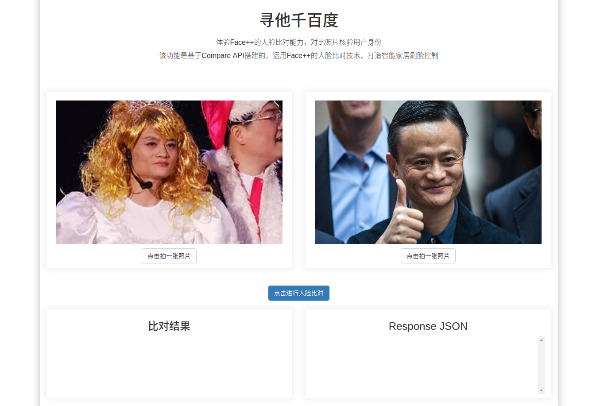
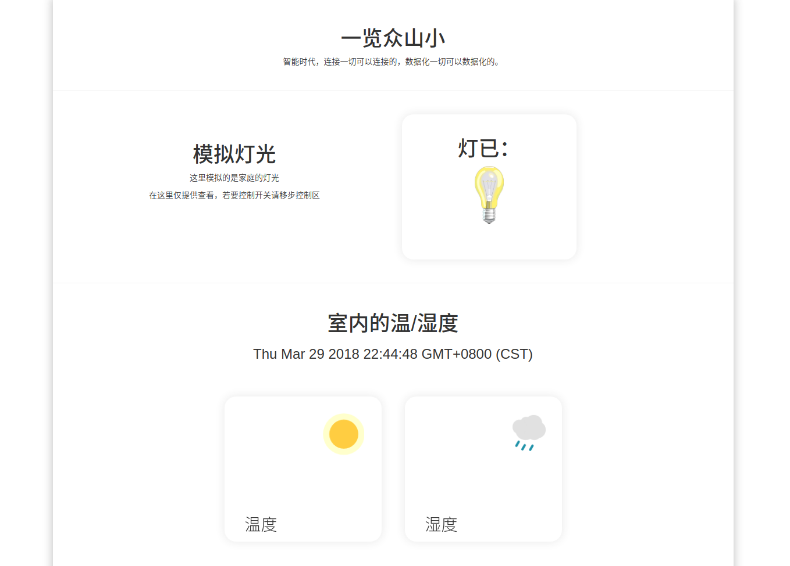
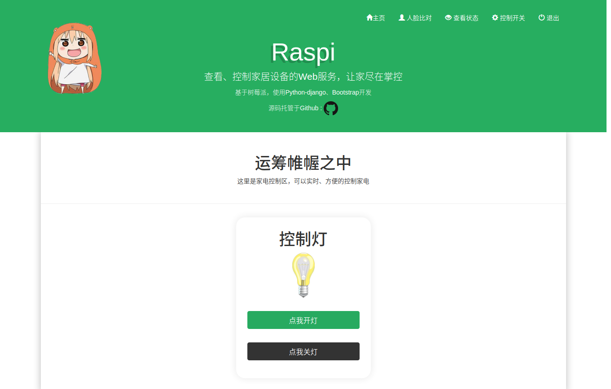

# 《基于树莓派的智能家居监控系统》

## 简介
raspi是我本科毕业论文的一个paper，从2017年3月到6月份完成，对于一个没怎么接触软件领域的微电子学生来说已经是一个天大的工程！毕业万岁~\(≧▽≦)/~

关于这个project：
- software：主要使用了 python2.7 + django1.11 + bootstrap3.3 
- hardware：树莓派3B+、摄像头、继电器、DHT11温湿度传感器、LED等等
- 系统环境：基于debian7定制的树莓派官方系统raspbian
- 第三方接入：face++人脸比对、百度tts文字转语音

实际上软件部分还用到了树莓派的官方系统raspbian提供的驱动，比如摄像头驱动模块picamera、IO接口模块RPi.GPIO。因此，原理上clone这个repository到本地pc上是无法running的，需要做一些修改，后面会提到。

## 功能
- 访问权限：只有登录才能进入web页面，控制家居设备。
- 温湿度实时监控
- face++d人脸比对 + 百度语音 +继电器 实现安全门禁,刷脸开门！
- 控制家电开关：这里只实现了LED模拟家庭环境

实际上我还接入了google-assistant的SDK，可以chat with google assistant～，但由于当时google-assistant才刚开放(没错就是在github),还处于测试阶段，接入语音控制这些功能都还没有，语音助手纯属就是一个玩具；(

## 页面展示
#### 首页

#### 人脸比对
face++的人脸识别技术真是太棒了，支付宝刷脸付款用的也是face++，呐，我用face++的时候老罗的坚果pro2还没用上呢，哈哈。

#### 查看温湿度
温湿度用的是DHT11这个模块，说来奇葩，和我同一组的两个妹子用的也是DHT11，答辩的时候老师很不高兴。其实最重要的是温湿度显示的实时性，使用ajax和定时器，每隔几秒从后台读取一次数据。

#### LED模拟控制室内灯光
本来导师强调要控制空调、电视机等一些比较现实的家电的，但想到答辩的时候也不会提供这些，也不好展示，因此就只控制了一个LED，有点囧o(╯□╰)o

#### 登录界面
没啥好说的，django提供了login验证，只要在后台注册管理员账户，一切都so easy～

## 如何在本地运行
- 安装django1.11 + python2.7 ，注意django的2.0版本和1版本不兼容。
- clone到本地：
> 1. app/urls.py把 from . import views 改成 from . import cp_views as views 。  
> 2. app/urls.py 把最后这两行注释：
    
url(r'^take_a_photo$',views.take_a_photo)

    
url(r'^face_compare$',views.face_compare)

> 3. 运行：
    
$python manage.py makemigrations

    
$python manage.py migrate

    
$python manage.py createsuperuser

