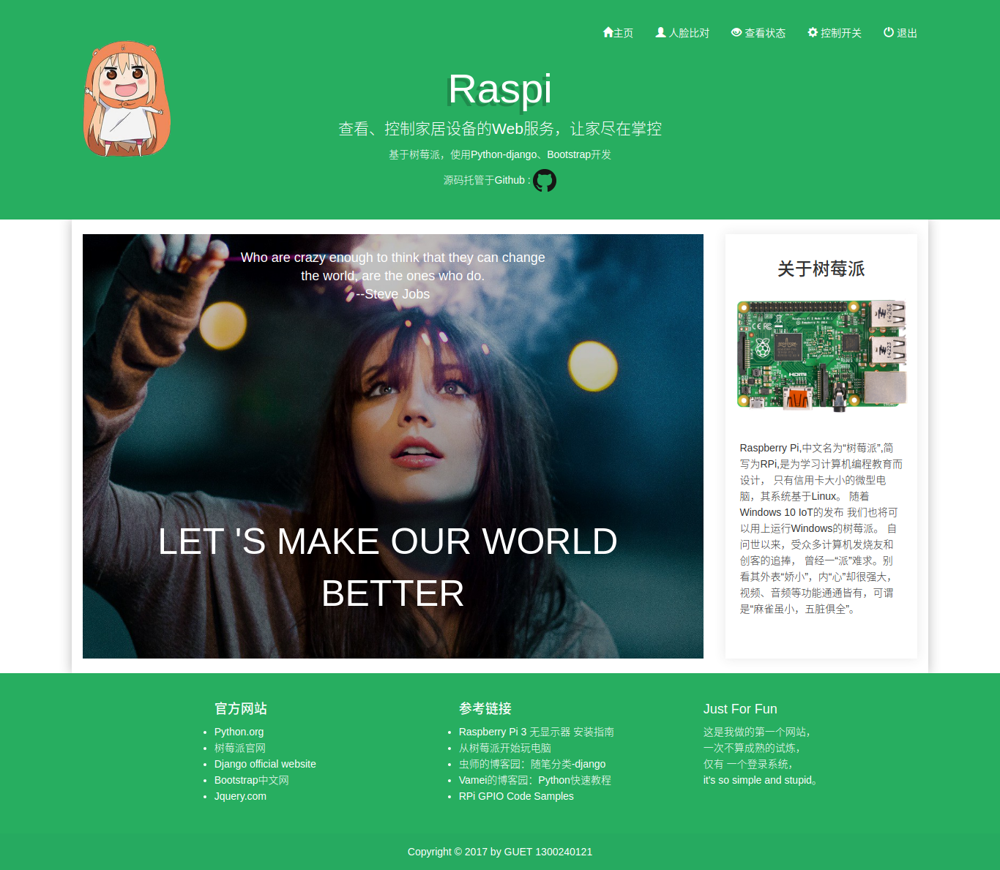
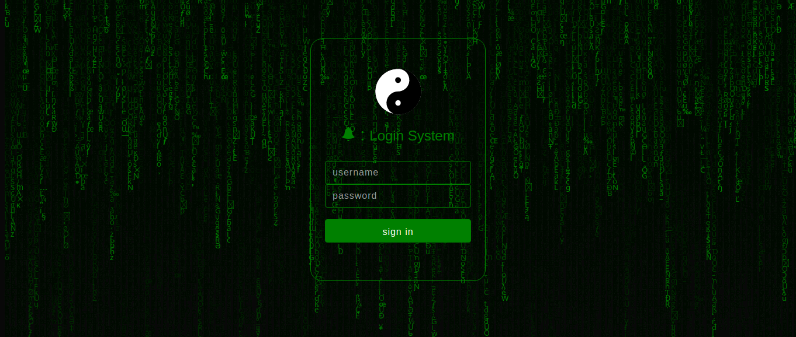

# Matrix介绍

这是我本科的毕业设计——《基于树莓派的智能家居监控系统》中，分离了硬件核心代码的一个django web服务。 
这个web服务实现了只有管理员才能登录的访问权限,以使只有主人才能访问和控制家居设备。
使用了:

- python 2.7.13
- django 1.11
- bootstrap3.3.7

### 主页展示

### 登录展示

# 如何使用

### 初次使用需要创建django的admin管理员账户,进入项目根目录执行一下命令:
- $python manage.py makemigrations
- $python manage.py migrate
- $python manage.py createsuperuser

